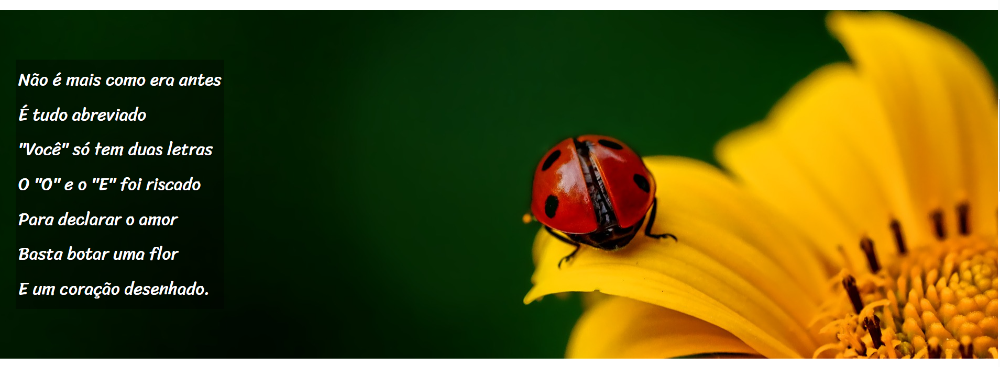

# 🎨 Desafio Cordel Moderno

🌾 Projeto feito durante o curso do Gustavo Guanabara para praticar o efeito de **background fixo** (parallax simples) em páginas web.

## 📌 Sobre o Projeto | About the Project

Neste desafio, a ideia foi criar uma página com um background estático que parece fixo enquanto você rola o conteúdo, criando um efeito visual de profundidade e camadas.

---

This project was developed during Gustavo Guanabara's course to practice the **fixed background** effect (simple parallax) in web pages.

The idea was to create a page with a static background that appears fixed while scrolling content, creating a visual depth and layering effect.

## 🛠️ Tecnologias | Technologies

- HTML5  
- CSS3  
- Git & GitHub

## 🎯 Funcionalidades | Features

- Background fixo enquanto o conteúdo rola por cima  
- Layout simples e limpo  
- Uso de propriedades CSS modernas para posicionamento

---

- Fixed background while content scrolls over it  
- Clean and simple layout  
- Use of modern CSS positioning properties

## 📷 Screenshot

 <!-- Substitua pela imagem real do projeto -->

## 🔗 Link do Projeto | Project Link

👉 [Veja o projeto online](https://leticiamaca.github.io/desafio-cordel-moderno/)

## 🚀 Como Rodar Localmente | How to Run Locally

```bash
# Clone o repositório
git clone https://github.com/leticiamaca/desafio-cordel-moderno

# Acesse a pasta do projeto
cd desafio-cordel-moderno

# Abra o arquivo index.html no navegador
```
### 📚 Aprendizados | What I Learned
- Uso da propriedade background-attachment: fixed no CSS

- Técnicas básicas de layout e posicionamento

- Desenvolvimento de páginas responsivas simples

- Use of the CSS property background-attachment: fixed

- Basic layout and positioning techniques

- Development of simple responsive pages

### 👩‍💻 Desenvolvido por | Developed by
Letícia de Castro Jacob Marques
GitHub Profile
